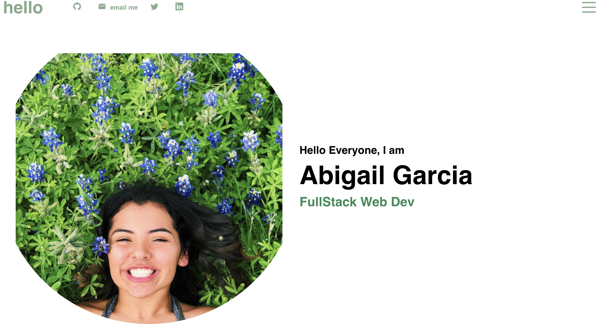

# React-Portfolio2

## Description

I built this project so future empoloyers can have a clean portfolio to look at when Interested in hiring me. This portfolio has some of the projects I have done, and about me section, and links to my github , linkedin, and email adress if they would like to email me. This project also allowed me to expand my knowledge on react and many different language I have learned throught the course by creating a single page mobile responsive application. During this project I also challenged myself to use frameworks I normally have not and learn more about jsx.

## Table of Contents (Optional)

If your README is long, add a table of contents to make it easy for users to find what they need.

- [Installation](#installation)
- [Usage](#usage)
- [Credits](#credits)
- [License](#license)

## Installation

N/A

## Usage

To use this page you will be first directed to the homepage where you see a navbar, current picture, and my role. Underneath that is a small arrow button you can use to scroll down to the next page or the hamburger menu on the side will allow you to navigate to different sections of the page! If you ever want to go back to the home page just click the "Profile" in the top left corner and it will take you back there!

Deployed Application: 

## Credits

- My tutor Andres and Taylor for helping with the problems I had deploying
- https://stackoverflow.com/questions/44154939/load-local-images-in-react-js
- https://create-react-app.dev/docs/getting-started/

## License

For more refer to the documentation in the repo: https://mit-license.org/

## How to Contribute

The [Contributor Covenant](https://www.contributor-covenant.org/) is an industry standard
